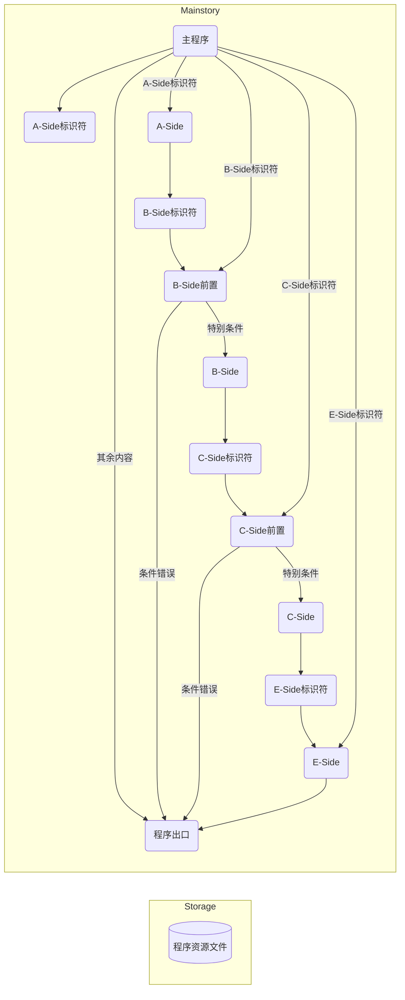

# Sateri Project Demo

Sateri Project（萨特莉计划），Sateri是“那位少女”的名字。

## 简介

Sateri Project本身于2024-09-05启动。

将这个计划中灵感的一部分给[《蚊的音MAD征集令3＆4》](https://www.bilibili.com/read/cv38118741/)。

这一部分是，因为<mark>一下子的想法</mark>而生，从而产生的不断演进、不时保存Checkpoint（检查点），最终完成的与Sateri Project<mark>完全无关</mark>的作品集合，称作Sateri Project Demo（以下简称SPD）。

关于这个作品背后的内容见[主程式](docs/main-story.md)。

## 游戏方法

本程序文件结构如下图所示。

## 重大变动记录

日期采用“MMM dd”的模式**顺序**记录。

基准年份为2024年，例如，在9月后出现1月，则该1月实际为2025年1月。

|日期|事件|
|--|--|
|Sep 05|Sateri Project启动。|
|Sep 13|SPD启动。|
|Oct 02|完整确认弃置SPD的Tauri源码系列，改用脚本策略。|
|Oct 04|A-Side定稿。|
|Oct 23|为学业上的原因搁置，进度暂缓。 |
|Oct 29|暂定整部作品的主题和结构。|
|Nov 02|“关键性否决”|

详细的灵感变动列表见[日记](docs/diary.md)。

## 致谢

本作品的完成离不开以下的作者们，一并表示感谢。

**以下按首字母排序**，**以下按首字母排序**，**以下按首字母排序**，重要的事情说三遍，也欢迎各位去支持这些内容创作者。

展开/收起

 

|名字（常用称呼？）|站点|帮助|
|--|--|--|
|樱宫艾拉（艾拉）|[B站](https://space.bilibili.com/22807093)、[个人站](https://aira.cafe)|灵感来源、技术支持（程序）、精神支持💖[KIRAKIRA](https://github.com/KiraKIRA-DOUGA/KIRAKIRA-Cerasus/)|
|alivemaster（死大师）|[B站](https://space.bilibili.com/129967395)、~~个人站已经死了~~|灵感来源、直播内容讨论、程序测试|
|沉眠梦中的苏西（苏西）|[B站](https://space.bilibili.com/81244315)|技术支持（绘画）|
|城惠sama哒（城惠）|[B站](https://space.bilibili.com/517013889)|技术支持（哲学）|
|ColaLK（可乐）|[B站](https://space.bilibili.com/7346049)|直播内容讨论、精神支持|
|稻米纳特（稻米）|[B站](https://space.bilibili.com/108896943)|灵感来源、技术支持（绘画）、小鮟鱇🥰|
|FFFanwen（凡文）|[B站](https://space.bilibili.com/3858957)|直播内容讨论|
|海百合海底捞|[B站](https://space.bilibili.com/354309444)~~但是没投稿~~|技术支持（医学）、精神支持|
|Hakadao|[B站](https://space.bilibili.com/5011356)、[个人站](https://bento.me/hakadao)|技术支持（程序）|
|九冻夜雀舌（九）|[B站](https://space.bilibili.com/3493126662523730)|灵感来源、技术支持（哲学、天文学）|
|凉郁（凉凉）|[B站](https://space.bilibili.com/561222)|**音声监督**、精神支持|
|铃仙Official（兔）|[B站](https://space.bilibili.com/39934876)|精神支持|
|MapleTofuuuU（麻婆豆腐）|[B站](https://space.bilibili.com/304189814)|技术支持（映像、绘画）、精神支持|
|Mayflew（梅富路）|[B站](https://space.bilibili.com/21601552)|技术支持（哲学、创作）、精神支持|
|megakite（筝）|[B站](https://space.bilibili.com/1892024)、[个人站](https://megakite.icu)|技术支持（哲学、音声）|
|塩見斷漄（<ruby>塩<rt>しお</rt>姐</ruby>）|[B站](https://space.bilibili.com/411414378)|技术支持（绘画）|
|十拾I0（十）|[B站](https://space.bilibili.com/326257606/)|精神支持|
|Snaur（卵）|[B站](https://space.bilibili.com/435083)|技术支持（哲学）、直播内容讨论、精神支持|
|SuperSuika（西瓜）|[B站](https://space.bilibili.com/691399674)|精神支持|
|WZQ02（WZQ）|[B站](https://space.bilibili.com/12367945)、[个人站](https://wzq02.top/)|技术支持（哲学）、精神支持|
|析无澈海（海）|[B站](https://space.bilibili.com/1539434)|技术支持（心理学）、精神支持|
|盐酸帕罗希汀（盐酸）|呃这个看上去不需要放|技术支持（音声）、精神支持|
|我的自然辩证法专业课老师lmao|-|~~非主动~~技术支持|
|所有没有提到的，在看着的大家|[B站](https://space.bilibili.com/)|精神支持|

