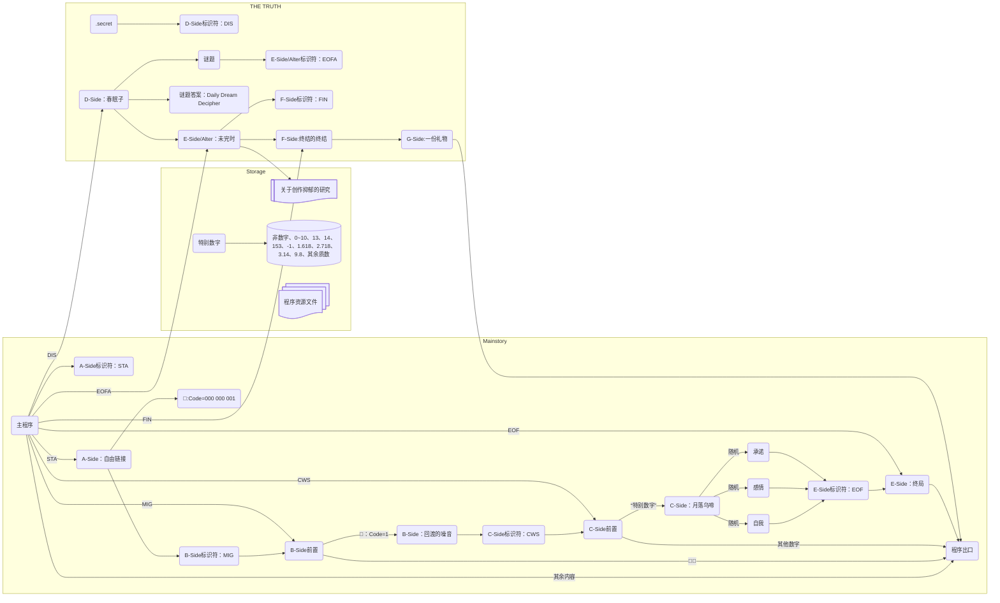

本文档是SPD的背景相关内容。

作为事实的，D-Side与之后的内容。

完整的程序如下图所示：

# D-Side：春眠子

D-Side: Died in Spring，标识符DIS，这个标识符隐藏于C-Side的结尾。

关于我，关于这个的世界组成。

本节与D-Side故事同时完稿。

## 旧

先来解释一下这个标题吧。春眠子，我新换的昵称，眠是死的代称，所以春眠子的意思是死在春天，只是恰巧觉得合适就用了，改这个网名的时候其实没想到要写这篇小说。

在10月7日看完法条遥的《REWRITE》之后，一下子重新使我拾起了写这种本格推理小说的兴趣，再加上最开始构思这个作品想到了一些“自杀式的宣泄方法”，包括设计了一些让Sateri死去的情节，又或者是想要假装自己死去，并指责在场的所有人都是犯罪者——一个大胆的想法浮现在我的脑海中，那就是我也要不要试试看写一部这样的小说，小小说也行。

就这样想着的时候，第一部分，也就是“24年9月的一个晚上”，很快地也逐渐浮现出来，我也想到了我在西安的这段日子。趁着这股势头，我把它写完了，也还是磨了一段时间，找GPT要了不少建议（虽然都不大合我意，但是找到一些“反面”的方向也不错。

故事的情节大部分是虚构的，但也有很多真实的地方。

> 在第五章的位置，那段迟到是真实发生的。我寝室在的地方距离教学楼很远，所幸中间有条小道，才笔直一些。
>
> 那天不是十月下旬，而是十月上旬，吐是真的吐了，不过没去厕所而是直接吐在座位上了。血迹确实有，不过“大片”不至于，只是一些背上的血斑而已，恰巧那天起的比较急，衬衣穿反了。

读过这篇小文章先行版本的朋友知道了这些，都觉得我身体状况不大好，或许确实如此，或许也没有。自从大四那年之后，究竟睡了多少个安稳觉，多少次晕眩，错过了多少早餐的时间，又多少次熬夜到了凌晨两三点的时候，我记不清了，我忘性很大，不过体检，无论是学校组织的那种垃圾体检，还是标准的体检套餐也好，除了轻度的高血压以外似乎没什么问题，我自己知道的也就腱鞘炎、中耳炎、颈椎病、牙病和消化不良而已，都是些长期工作落下的常见疾病。

身体上是，精神上或许也是。虽然还是可以正常的和各位在这里交流，但是如果拖到六角亭（注：武汉市精神病院的代称）去，有点癫的状态十有八九会被当成放出来的精神病。不过我一直也觉得人要有点癫的状态才好做创作，和做梦很像：吃了毒蘑菇的人会看到小人，人的记忆和神经以一种混乱的方式组织起来，把印象变为了视觉；如果把这种可能性推广到做梦和创作，那么人旧有的积累也一定可以通过混乱来随机地结合起来，形成很跳跃的，很新奇的东西，就好像我的“卫星说”一样。

嗯，扯远了，还是回到这个作品吧。

最开始的九月，是“自杀式的宣泄”。我最初为Sateri写结局的时候，三个结局全是自杀：一个是卧轨，像海子一样，如昙花般盛放，而后死去；一个是毁灭铁轨，让大家一起陪葬，就像想要毁灭天空的Hacchi一样；一个是投海，像王国维一样，复归旧乡，以死证道。

然后，想到了另一个结局，想到了欺骗，想到了空留下一封写着三个结局的遗书，而静静地走向远方，走向自己固有的死亡。

然后，从Sateri，到了我自己，我甚至这样幻想：

> 当你们读到这段文字的时候，我不知道我已经在何方了。XX天前的时候，我已经在【给出一个在铁轨的经纬度坐标】的这个位置，踏上回家的路，不过不是在列车上，而是在列车外。我仿佛已经看见了动车夜晚的灯光将要照射到我的身上，然后将我碾碎。
>
> 我累了，我真的累了，我比以往还要来得更加疲惫，这全都要拜音MAD所赐，拜创作所赐，是创作让我死亡，而且我已经论证了这一切。
>
> 我猜，火车呼啸而过，肯定要把我撞死，那么，在场【直播间】的各位，全部都是杀人的罪犯；如果我侥幸没有死成，我也不再继续创作，我已经把作品托付给了XXX，接下来的一切都与我无关了。
>
> Sateri

就这样，在创作的过程中，恰好经过了严寒的十月中旬，气候降温，人的心情也达到了谷底，我把这段时间称为“十月病”，比“九月病”——抗拒开学的情绪还要严重地多。有一些学生步入大学，或者正在读，还有高中。路过了九月的新奇，结束一年最后的长假——十月黄金周，在ecstasy过后进入了漫长的调休工期，大多持续两周，这一重担产生的落差是无法比拟的，外加降温、变天，种种的外部因素带来了极为强烈的情绪的不安，和想要毁灭的愿望。我甚至差点真的失去了我的一些朋友。而这样的事情又一定会在次年再次上演的吧，我想。

我开始重新设想这些未曾发生的死亡，它们在梦中发生了无数次，如今又发生在小说里的他和她身上。我正想不通的时候，我的老师一堂课上的话点醒了我：

> 用道家的话来说，死亡是消散，复归于自然。

这与我的欺骗不谋而合。

现代的精神病学、哲学、心理学都说，死亡是一种强烈的爆发，一种承载力到达临界点之后的崩坏，我一直固执地这么认为，竟忘了这么重要的，带有中国色彩的“无常”。

在这同时，受到了本格推理小说的启发，我决定把这个作品中出现的人物的死亡设定为意外，并且不再更改了。

创作与死亡的关系留在最后的E-Side/Alter谈吧。

这部小小说也是我创作的映射吧，又有些像庄子，我并不知道我是因为创作才喜欢上了星星，亦或者是因为星星才想到了创作，又或者是来到了西安这边过后，因为地域的因素相辅相成的作用。但无论如何，这部作品就这样呈现在了大家的面前，我觉得还挺好的。

这个作品的谜题，谜底是Daily Dream Decipher，这是进入E-Side：Alter的钥匙。

虽然Die是死亡，D却是一个充满了生命力的字母，这也是为什么整个故事看上去都会和字母D息息相关的缘故。从Die（死亡）说起，到了Depression（抑郁），到了Dream（梦），到了Deprecated（已废弃的），再到Departure（启程），Diging（采掘），Dimension（维度），Decipher（解码）。

只要愿意去思考，就会有无限的可能，这也是这个作品，整个Sateri Project Demo现在想要传达给大家的，

一部分。

## 增补241023

原来是小E存活，小F死去，现在两个人都不必死了，谁都不必死。

我真是犯蠢，如果为了让观众思考而选择了让观众痛苦，随意地让虚构的人物死去，那和丧失人性的杀人狂没有区别。

见[反殉道_新](../assets/txt/thought/反殉道_新.txt)。

# E-Side/Alter：未完时

E-Side: End of File，是虚假的结尾，献给平凡观众的Normal Ending。

E-Side/Alter: End of Fortune，标识符EOFA，是我想要留给读到这里的创作者们的。

文件读到了末尾，故事还没有结束，命运的偶然性到达了尽头。

我想讲讲2020年到2024年这几年我的研究发现，创作与创作抑郁之间的更加深刻的联系。

其实主要是2024年的一些研究，看了一点心理疾病学的东西，感觉一下子就和前面的内容贯通起来了。

我把这些单独整理进了一个文件，当故事进行到这个部分的时候，你们就知道是什么了。

# F-Side: 终结的终结

F-Side: FIN，标识符FIN。

一切都将迎来其尽头，然后又焕发新生。

这是这部作品真正的结束。

请放心，没有什么恶意程序，不过因为测试了之后的缘故最后还是决定加上警告，因为毕竟真的会把电脑关了然后重启。<s>不过测试人员是虚拟机里面跑的实际上也没啥损失。</s>

=> 实在是无奈之举，vbs如果要更换壁纸的话，似乎必须要重启才能生效，所以只能这样了。

<s>其实不必，但是我想如果把电脑关掉再重启会比较有趣，这个灵感和之前玩过的Oneshot有关。</s>

给电脑新设的壁纸是我很喜欢的牡丹もちと老师的咖啡之月的某一章节的插画，很好看而且色调也很合适，用了几年了。

说来也是有意思，牡丹もちと老师曾经说过这部作品是做着“找回手感”的，从2020年开始连载到2021年突然如失踪了一般就弃坑在了半路上，像是183那样，查wiki的时候才发现原来2024年又发了第六卷，就像是复活了一样。

# G-Side：一份礼物

G-Side: Good Luck，跟随在F-Side之后，没有标识符。

作为F-Side的补充，仅作凑数之用，也是Gift。

七这个数字我真的很喜欢，五（阳之盛）和九（阴之盛）的平均数（阴阳中和），六和八的平均数，充满了一种不对称但是又富有规律性的美感。
