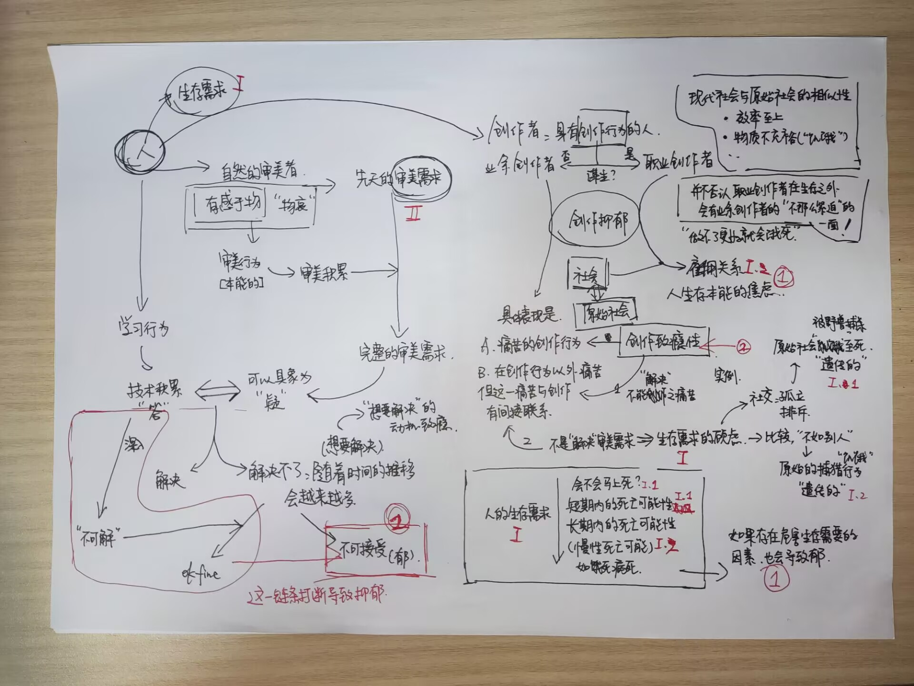

关于抑郁的研究，尤其是创作者中抑郁的研究。

本文全文内容较长。

本文中有一部分内容是将已有的理论作为公理使用，如弗洛伊德的精神分析理论，马斯洛需求层次理论等；除此以外存在**极端的个人化叙述**与大量**过时（已经被否定）、混乱的观点**，因此姑且仅作为**归档**使用。

⚠️如果执意要读下去，请保持一定的理性和耐心。

# 0 笔记

这一节整理了一些比较重要的部分，可以快速跳转到对应位置。

[蚊集令的灵感来源](#22-思考也是创作的一部分)

[核心理论与结论 —— 不可解理论](#5-十月讨论下不可解理论)

[到此为止](#55-到此为止)

[悲伤的自指](#621-引言)

# 1 一切的开端：审美致死性的妄断

## 1.1 断言

在多年之前，我的一个朋友曾跟我说，永远不要去碰“某扇门”，否则就会陷入万劫不复的境地，那时的我还尚不理解这句话。但到了今日，我也在无意间将那扇门打开，读过了一些文字之后，理解了——那是可以预见的将死的结果。

在开始下述的断言之前，需要以两条大的前提作为基础：

- 一是，人类的弱小尚不足以反抗数学中指数级别的武器；
- 二是，在打开那扇门之后，人的欲求会呈*指数级的、量子而非连续的*增长状态。

有这两条前提，便可以断言：在打开门之后，人便是*将死*的——并不一定说是自杀，也有可能是意志的崩溃，以至于因为药物、酒精、饮食问题、缺乏锻炼等出现生理上的病变，而后被扭送到精神病院接受治疗了。

再下述，对这两条前提展开论证，以及讨论人是否一定是将死的。

## 1.2 指数的武器

第一条前提，有很多的例子可以举。比如：

- 宇宙的可观测体积，不过也不到 1e100 立方米这样一个数，它在可数的无尽里面却是相当小的一个数，再随便再加几个零，比如 1e1000，这样的数量级的物质，足够让宇宙崩溃；
- 棋盘的米粒，以 2 为倍数指数级增长，64 格的棋盘上的米粒用任何粮仓都装不下；
- 重力加速度下作用的花盆，从 10 楼坠下，足够把人砸成重伤，甚至死亡...而指数的增长速度是远快于重力的“幂”的增长速度的...

与之而来的，第二条前提比较拗口，它需要解释的有这样几个部分：“那扇门说什么”“欲求一定是成*指数*增长的吗？”和“欲求一定是*增长*的吗？”

## 1.3 城市的问题

“打开那扇门”依我个人的看法，是持续进行*有意识的*审美，区别于*无意识的*审美。

在下面的论述中，我们设定“那扇门”的内涵即为“有意识的审美”，作为前提。这一前提是我们讨论的基础，无需进一步论证。而所谓“有意识的审美”，指的是个体在审美过程中具备明确的意识和目的，能够主动选择并体验美的事物。基于这一定义，我们将探讨“有意识的审美”如何引发欲求的“指数级”增长，并进一步分析这种增长如何影响个体的精神状态，乃至引起人之“将死”。

为了方便理解和叙述：

- 先划两条线，一条是社会普遍存在的情形，一条是社会普遍存在的需求，把低于普遍情形而希望达到普遍情形的欲求作为“无意识审美”的标准，把低于普遍需求而希望达到普遍需求的欲求作为“有意识审美”的标准。
	- 这两条线相对划的低了一些，因为社会关系依旧存在，还尚未达到政权瓦解的状态，就暂先以当前的状态划了这两条线。
- 社会普遍存在的情形和需求，实际上是由无数个体欲求的集合和反映；个人无意识审美和有意识审美，其实质是对社会普遍情形和需求的内化和表达。社会普遍情形与个人欲求之间的关系，并不会是等价的，可以看作是一种互动和反馈的过程，在这里就姑且等效替代了。

相较于远古时代，2024年的今天已经算是高度物质发展了，但依旧不可能做到让所有人都开始有意识的进行审美活动，绝大多数人都还在无意识审美的状态。

举个例子，可以把社会的底线作为前标准，把社会认为的善作为后标准，如“抢劫”“行窃”可以作为不满足前标准的事件，把“闯红绿灯”“漠视而不扶老人”作为满足前标准而不满足后标准的事件，人们期待大家自力更生、不去偷抢，是无意识的审美，人们期待大家遵守交通秩序、信任待人，是有意识的审美。前者在法律等的约束下，较为容易实现，而后者基于人的“公德”，是很难在现在的社会*经常*得到实现的。

按现在社会的人的状态，本能地进行无意识的审美，极少数的连无意识的审美都做不到——那是如原始人一般茹毛饮血的所谓“未开化”的状态。

- 需要注意的是，即便是偷抢的人，他们也应该是*知道*不应该偷抢的，这是无意识审美的思想与行为不匹配的现象，但并不意味着在潜意识里不会进行无意识审美；同样是偷抢的例子，做不到无意识审美的，常见于“无民事行为能力”的人——而且是在这类人群中，根本无法*辨认*法律的。

而对于有意识的审美，则要分为三派：

- 一派是根本不会进行有意识的审美，这与受教育的程度有关——如果没有接受过类似的教育，那么肯定不会进行这样的审美。这在人群中依旧是少数，至少在当今，大量的农村也开始普及基础教育的情况下，像是“连红绿灯是啥都不知道”的人肯定是越来越少了。
- 剩下的两派则接受了类似的教育，多以城市的居民为主，一旦有了有意识审美的基础，则一定会开始进行这样的审美，区别在于后续是否停止，即是否从潜意识里开始*主动拒绝*有意识的审美，这是社会的现状导致的，也可以说是城市的问题。

很显然，前标准是低于后标准的。在现在的社会，前标准往往能得到满足，而后标准人们期待它得到满足（主动的审美），却往往不能得到满足，换言之，就是“人民日益增长的美好生活需要和不平衡不充分的发展之间的矛盾”——这种矛盾便是当今社会的问题。

## 1.4 欲求增长过后

在得不到满足很长时间之后，要么退而求其次，主动拒绝此类审美，成为一派；另一派在漫长的得不到满足之后坚持此类的审美。在这里，我们需要讨论的“打开那扇门”的一类人，就是其中的后者，得不到满足是痛苦的。

这时，需要举出新的有意识的审美的例子，进行再深入的论证。

超出社会底线的善，比如对于艺术的追求，寻找符合艺术的美，同样是后标准的，但这以社会的中位数阶层来看是不会得到完全满足的，往往会受制于经济等多方面因素，呈现出“积累-满足-提高要求-再积累-再满足”亦即*阶段性满足*的特性。

特别值得注意的是，在这个循环中，“提高要求”的部分呈现出指数级别的增长趋势，不妨这里就把下限规定是一段时间后会变成原先的1.1倍（也许是1.01，但一定是一个大于1的*确定的*数，而*一段时间*会有多长，可能是一周、一个月、一年，也存在一个*确定的*上限），数学的量化保证了欲求的增长是*指数的*。即随着审美经验的积累和满足感的实现，个体的审美要求会迅速而显著地提升，而经济水平受限于一个范围，增长速度与提高要求的速度不匹配，必然会导致二者的强烈矛盾，使人的痛苦开始积累。

以一个中位数阶层的艺术爱好者为例，他在初步接触并欣赏绘画艺术时，可能会满足于一些基础的作品。随着时间的推移，他逐渐积累了对艺术的理解和经验，审美水平得到提升，从而对于作品的品质和内容提出了更高要求。他开始寻求更精细的画风、更深刻的主题，这种“提高要求”的过程并非线性增长，而是呈现出指数级别的跳跃，使得他不断追求更高层次的艺术体验。

根据以上的两条的论述，去推断*指数级别持续增长的*欲求，在*时间足够长*的情况下，足够让人*将死*，是再自然不过的事情了。比如，从心理学的角度来看，欲求的指数级增长往往伴随着对目标的不断追求和无法满足的渴望，当个体无法满足这种不断增长的欲求时，可能会体验到挫败感和焦虑感，这些负面情感长期积累，可能导致心理失衡，进而引发一系列的心理问题，如抑郁症、焦虑症等；从医学角度来说，长期的心理压力、焦虑和抑郁等情绪状态与多种疾病的发生和死亡率的增加有关。这些疾病包括心血管疾病、消化系统疾病等，它们也都可能由心理压力引发或加剧。

痛苦的积累需要时间，时间越长隐患越大。如果速度趋缓，往往会出现疾病先行，即人在自然的原因下死去，与欲求的矛盾无直接关联，这种情况是可以接受的。

## 1.5 遗忘是个好东西

还有一条没有讨论，就是“欲求一定是*增长*的吗？”

不论古今，不论中外，很多人都把“婴儿”的状态看做至上的、好的，因为婴儿的状态是最本真，欲求最少的：

> 知其雄，守其雌，为天下<ruby>谿<rt>xī</rt></ruby>。为天下谿，常德不离，复归于婴儿。
> 
> ——《道德经·第二十八章 常德乃足》

> 说：“我实在告诉你们：你们若不回转，变成小孩子的样式，断不得进天国。
> 
> ——《圣经·马太福音 18:3》

这是“欲求-满足”链的漏洞——如果没有积累的过程，或者让积累丢失一部分，那么欲求就不*总是*增长的。回退到婴儿的状态，或者退而求其次，让欲求暂且不再增长，这样就不至于说是无穷无尽地扩张。

那么，有没有办法这样呢？

答案是肯定的，需要借助一个工具，那就是*遗忘*，遗忘是最有力的让积累丢失的工具。

记忆的丧失并不是被动的过程，恰恰相反，遗忘更像是一种主动的过程，我们的大脑在不停地遗忘。对一些动物（抑或是所有动物）来说，大脑的标准态并不是去记住，而是去遗忘。

一方面，正如上面所论述的，指数的武器对于人类而言太过于强大，人类的神经元的有限就保证了人类无法完全记住社会中所出现的指数级爆炸的信息量，就必然需要遗忘以保证知识的更新；另一方面，主动的审美过程一定是痛苦的，而人类或者说动物全体是趋利避害的，这就使得人类进化出了遗忘的能力。

因为遗忘，一些旧的主动审美的知识就会丢失，欲求就会衰退。如果衰退的速度大于积累的速度，那就无事发生；而积累的速度过快，依旧会导致最终的崩溃——在这之后，又会得到一个新的有趣的推论，那就是天才反而更容易变成疯子，这也是很自然的。

## 1.6 漏洞

> 欲求增长过后一节有一句这样的论断：
>
> “提高要求”的部分呈现出指数级别的增长趋势。

这个实际上是不准确的，也就为后续对这个理论的推翻奠定了基础。

同时还需要指出，”审美“在这里的定义是混乱的。

# 2 音MAD华过后：创作的问题

## 2.1 成瘾性论述

起因：“创作，一定是快乐的”。

质问：“创作的快乐，是真实的快乐（多巴胺式的），还是毒品式的快乐？

——毒品式的快乐指，像毒品一样成瘾，一旦失去创作，就会陷入如毒品戒断那般的痛苦、抑郁，甚至产生自残自杀行为。

上述的致死性理论从逻辑上论证了成瘾性的依赖，产生于人本能的审美需求。

## 2.2 思考也是创作的一部分

> 这一点也是本次蚊集令作品的灵感来源——把广泛、丰富而跳跃的思考作为作品，即便是183或者仅仅只有想法也一并记录下来。到最后会发现其实东西真的不少。
>
> ——当然有些作者忙于学业，在那样的阶段，思考的丰富程度肯定是不足的，因此连同思考本身也会很少。虽然没有产出，也没有思考，但不是说这是“完全不可接受的”。

起因：存在这样的现象——很多创作者花费了很多的时间去思考，却没有实际的产出，因此认为自己的创作行为没有对自己产生实际上的帮助。

分析：这实际上是创作者忽视了自己在创作中思考的部分，事实上，有相当一部分作品的思考的成分与实际创作的技术实践部分对等，甚至更甚，有的“思考八年，一下子就做完了”的也不是没有。因此不应该否认自己的思考也是创作行为，思考也能产生进步的逻辑。

# 3 九月讨论：审美需求与抑郁的治疗

本部分讨论的开端是[守住良性多巴胺系统是在保命防抑郁](https://www.bilibili.com/video/BV19tszeWEG6/)。

和朋友讨论的结果是，这个视频的观点是完全错误的，原因见下。

## 3.1 需求理论

和朋友的讨论略去，仅表述结论。

人对于审美的需求是先天的，随着遗传和环境的渐长，而以阶梯式的样貌呈现；

人的朴素外源欲望是后天的，受环境影响比较大，渐进的、量子的、逐渐引人向崩溃。

形而上的美学需求具象化为美学的焦虑，美学的焦虑和幻想的焦虑，一起成为一个人具象的外在表现，然后被观测到，容易产生混淆。

 

美学焦虑的先天性很强，而且受人的不同而存在差异。

美学依赖的成瘾性来源于美的需求（见[2.1 成瘾性论述](## 2.1 成瘾性论述)），先天性的需求可能平平无奇。

但先天的环境，人的闲暇，潜在压力的缺失，引向了审美需求的增长。（公理，“人在闲时才会主动思考哲学）

持续地增长，无底洞无法填上，人就会因为抑郁而崩溃。

幻想的治疗不是“守住良性多巴胺系统”，一个切实可行的做法是“打破二元论”，见[青年的两次跨越](https://www.bilibili.com/video/BV1jJ4m1J7ba/)。

## 3.2 无知、忘却、吐纳

这一观点即日记补充中提到的对于创作抑郁的治疗对策。

有了以上的理论基础，将原先1.1中所表述的“忘却”治疗扩展到“无知、忘却、吐纳”的治疗。

**无知**的治疗指的是，审美的一增长明显与人获取审美知识的速度有关，放缓增长的进程就能抑制爆发。

**忘却**的治疗指的是，通过损失一部分审美的知识，降低审美的需求。这几乎是不可能主动实现的，通常只能通过人本身的趋利避害特性完成——即受到压力而生的知识的丢失，又或者是藉由意外事故产生（但意外事故本身对人有害）。

**吐纳**的治疗与**无知**很像，但区别在于**吐纳**描述的是创作的过程，在创作中获取知识，能够保持审美知识的获取与人审美行动的增长速度的匹配，使得审美需求的增长相对静止甚至落后于审美行为。

很显然，最好的**主动**治疗方法是**吐纳**。

## 3.3 漏洞

然而，实际发现，**吐纳**并不能完全解决抑郁的问题，因此依旧存在理论漏洞。

# 4 十月讨论（上）：防御理论

## 4.1 防御理论综述

以“防御理论”为核心的，结构化的，对于人的创作抑郁的完整归因及解决方案，见归档文件[《防御理论》](./depression-theory.assets/241030.pdf)。

防御理论很好地解释了前文中的**吐纳**不能解释的这一问题：

> 部分创作者在创作初期展现出极高的热情和积极性，即使面临创作上的困难和挑战，他们仍能保持积极的态度，仿佛得到了正反馈。然而，随着时间的推移，这些创作者进入中期后，他们的态度可能会大转变，变得消极和抑郁，即使强迫自己开始创作，也很难维持创作的热情，甚至产生更为严重的不满和抑郁情绪。

## 4.2 防御理论的论证问题

- 对于审美行为的描述混乱，缺乏对“审美进步”的讨论。
- 对于创作进程的描述过于公式化、刻板化，换言之，显然很多创作者并没有完整地经历过这样的过程。
- 对于人的审美需求、审美积累缺乏定义。
- 对于“无知、忘却、吐纳”的描述存在逻辑漏洞。
- 对于“遗传性防御的‘先天生理机制’”缺乏表述。
- 对于“社会性防御”的表述过于笼统。

# 5 十月讨论（下）：不可解理论

## 5.1 不可解理论综述

早期不可解理论的逻辑树概要见下图。

在5.2中，有一部分被重新表述了，会与这张图有所不同。

## 5.2 不可解理论的逻辑结构

按照马斯洛的需求层次理论，将其简化，可以分为生存的层次和精神的层次，后者也就是这里的审美。

### 5.2.1 生存

从生存的层次来说，又细分为两块：
- 一块是立即死亡的可能性，例如被野兽吃掉、车祸等；
- 另一块是长期死亡的可能性，例如疾病等。

从遗传的角度去分析，那么社会性质上的需求就是生存的需求。例如：
- 在原始社会中被孤立，就会带来被野兽吃掉的可能性；
- 在原始社会中的捕猎能力不足，就因为饥饿而死。

但与此同时不难发现，现代人的生存需求已经逐渐被满足，社会性逐步得到瓦解。人们不再像以前那么需要一个社会性的集体或者要被社会性的集体接纳。

### 5.2.2 精神（审美）

首先，定义这里的审美：它是有感于物——可参见“物哀”的概念。

人是自然的审美者，先天就具有审美需求，这是人类的本能——丑恶往往具有不安全的性质，例如传染病等，这又引回了生存的需求。

人同时具有本能的审美行为，对外物有所感触，进而产生审美的积累，审美的积累再带来后天的审美需求。

两种需求的结合，就是人的完整审美需求。

 

审美需求是“感于物”，是抽象的需求，藏于人的潜意识中，人对它没感觉。（“潜意识”的概念见弗洛伊德）

但通过“一定的条件”，审美需求会具象为“疑问”。例如，人会好奇“为什么这个物体会让我感到美好？”，这就是审美需求的具象。

人具有解决“疑问”的先天动机，因此“疑问”需要被解决，否则会产生焦虑。

这就是审美抑郁的根源。

 

通常而言，人具有学习的行为，通过学习产生个体的技术积累，例如，积累“1+1=2”，太阳会从东边升起等事实性的经验，获得“这个样子的是猫”这样推理性的能力等等。

技术积累可以解决审美需求的具象，但个体技术积累与审美的需求是不完全匹配的。有一部分的“疑问”可以被解决，但有一部分的“疑问”是不可解的，不可解的“疑问”积累起来，产生愈加严重的焦虑。

随着个体技术积累的进行，会突破到一个新的层次，也就是“不可解”，认识到有一些“疑问”在当前阶段是不可能解决的，这在一定程度上消解了“疑问”，将其重新埋回潜意识中，进而消解了焦虑。

### 5.2.3 再论创作者与创作抑郁

创作者的定义是，具有创作行为的人，区别于普遍的人。

这里的创作行为是，通过技术积累制作出具象的作品。

按照技术积累是否在生活起决定性因素，我们不妨将创作者分为两类：
- 一类是依赖创作维生的职业创作者，如主要的生活资料来源是创作的画家、作家，又比如程序员、农民这样的职业。
- 另一类不依赖创作维生的业余创作者，比如本职工作是程序员，但业余时间喜欢写作，那么从写作的角度来看，他就是一个业余创作者。——创作行为是“不那么紧迫”的。

不难发现，一个人可以同时是两类创作者，分析创作抑郁的问题需要将一个人的两种身份分开来看。

 

对于依赖创作维生的职业创作者，他们的创作抑郁应该归因于生存的需求。

对于不依赖创作维生的业余创作者，他们的创作抑郁分为多个角度去看：

- 遗传性的或后天的生理病变，如激素失调，伤及神经系统的物理创伤等，这些痛苦是生理性质的，与本部分讨论无关。
- 创作时的痛苦，如重复性工作的厌烦情绪、创作的困难等，这是技术积累不足与审美需求的不匹配导致的，属于审美性质的痛苦。
- 大多数人在创作的时候都是“开心的”。他们在创作以外的生活中感到痛苦，但这一痛苦与创作有直接的联系。究其本质，还是生存需求的顾虑。
  - 例如，会顾虑自己的作品是否会被人接受，会担心自己的作品是否会被人喜欢，会担心自己的作品是否会被人理解。作品不被理解意味着会导致人的在集体中的地位下降，而远古社会中地位下降会导致生存的困难（即这种意识被保留到了现代社会）。
  - 需要注意的是，这种现象正常来说已经随着社会性的消解而弱化，但部分人仍然会有这种潜在顾虑，这是“返祖”的现象。
- 不能创作的痛苦，最典型的就是没有时间，对于业余创作者而言，其社会身份决定了“创作的时间总是不那么充裕的”。进一步深究，对于业余创作者而言，“创作行为”是“不那么紧迫”的，因此需要一个创作的动机，又可以分为生存性动机和审美性动机。
  - 审美性动机即，业余创作者认为创作行为可以解决审美需求的具象。
  - 生存性动机即，尽管业余创作者不依赖创作维生，但他们仍然需要生存需求以外的社交需求，这种社交需求在创作行为中得到了满足。
  - 审美性动机和生存性动机的结合，就是业余创作者的创作动机，存在动机但创作的行为却受到限制，这就导致了创作的痛苦。

### 5.2.4 抑郁的消解

1.降低审美积累，或损失审美要求

降低审美需求通常采取的是“高压、幽闭”等方式，如学校内部的教育，军队的训练等，这些方式会让人的审美需求降低，但同时也会引起生存的抑郁。

通常而言，这种方式是不可取的，不过也有特例。以军队的训练为例，在军队中，尽管服从性要求很高，但军区人员的基本生存需求是得到了满足的——处在交战状态中的军人的生存需求未能得到满足，有研究明显表明了这种情况下的抑郁情况。

而损失审美要求，这代表着物理上的损伤，不具备可执行性。

2.抑制审美需求的具象

审美需求的具象化只能抑制，不可能从根本上阻绝。

3.审美需求的诱导性转化

审美需求的诱导性转化是指，将审美需求的具象化方向引向“技术积累”的方向，这样就可以解决审美需求的具象，从而消解审美需求的焦虑。

4.审美需求的不可解

审美需求的不可解是指，认识到有一些“疑问”在当前阶段是不可能解决的，这在一定程度上消解了“疑问”，将其重新埋回潜意识中，进而消解了焦虑。

 

再讨论先前提到的“无知、忘却、吐纳”。

无知：不进行创作行为，减少学习的机会。影响：
- 抑制了审美需求的具象，但仍具有爆发的风险。

忘却：通过意外事故产生的遗忘，或者退行性疾病导致的遗忘。影响：
- 物理损伤可能会进一步产生生存的抑郁。
- 退行行为的遗忘，依旧具有爆发的风险（创伤应激障碍）。

吐纳：持续的重复创作行为。影响：
- 将审美需求的具象诱导性转化，暂时消解了审美需求的焦虑。
- 通过创作行为产生技术积累，有一定可能进一步走向“审美需求的不可解”。

 

结论：审美需求的诱导性转化和审美需求的不可解是最好的可实施解决方案。想要从根本上消解抑郁情绪，终归需要认识到“审美需求的不可解”。

## 5.3 用不可解理论解释问题

### “一直学但是没有进步”

Q：如何解释一些创作者会感到“明明学习了很多技术，但是却越来越不满，感觉这些技术并没有帮助到自己”？

A：首先，在前文的讨论中已经表明，技术积累与审美需求是不完全匹配的。

随着创作过程的进行，技术积累和审美需求是同步发展的，但方向不一定一致，因此审美的具象并不一定会被技术积累解决，反而可能进一步积累，进而产生更大的焦虑。

有趣的是，随着时间的推移，在将来可能会出现这样的情况：某些方向上的技术积累会过剩，在某个时刻，可能审美需求一具象化就会被立刻解决，从而产生满足情绪。

### “学习行为没有影响我的决策”

Q： 如何解释一些创作者认为，“技术上有积累，但最终产生了不变的创作决策，因此没有进步”的观点？

A：首先，确定**普遍意义**下审美进步的定义：

- 生存的进步：产出更加被广泛的大众/专家认可的作品。
  - 为什么“专家”也可以——原始社会中“专家”在生存上具有优势，因此“专家”认可的作品也是生存的进步。
- 精神（本节所谈论的“审美”）的进步：“能够解决更多的审美需求的具象”的技术积累。

因此，技术上有积累，一定会产生精神的进步，但不一定会产生生存的进步。创作者这一观点的焦虑来自于生存进步的焦虑。

## 5.4 漏洞

- 一些结论是直接作为公理提出的，没有经过论证。
- 以不可解理论为基础，生存性抑郁实际上还没有很好的解决方案。——因为大的社会环境难以从根本上改变，而通过药物或其他医疗手段来解决生存性抑郁，实际上是治标不治本。

## 5.5 到此为止！

如果你仔细想想的话会发现一个问题：创作抑郁本身就是“不可解”的。

因此整个研究几乎就可以到此为止了。

# 6 十一月讨论：自指的研究

## 6.1 偏执理论

### 6.1.1 概述

从不可解理论出发引出的新的理论，关注的是“精神”的部分，得出的更加现实的结论是：

> 具有创作抑郁的患者，没有理解不可解，我可以认为其是一种“偏执”。

偏执的现象是会在某件事情上有坚持。

- 例如，中世纪画中对于神性或者是人性的坚持，可以力排众议甚至付出死亡的代价而要保持坚持。
- 例如，在创作中按照自己的意愿去调整，其他人的想法只能是“意见”或者是“灵感”（与潜意识相撞，但本质上还是由作者本人控制的分镜），不大可能成为主导型因素。

这样导致的结果是，偏执的患者往往是自满足的，不受其他人的干涉，好处是如果得到了满足那么不会抑郁；反之，如果得不到满足，就会引起抑郁。

偏执的程度决定了外在因素（如其他人）可以对抑郁的干涉程度。越偏执，那么他自己的抑郁就越只能由自己来解决（自满足程度越高），药物能依赖生物的机理起到一定缓和性的作用，但这种遗传性的影响实在太过于剧烈，就目前的科技水平而言不能根治。

### 6.1.2 它又说明什么？

从偏执理论看：

- 大多数人都不具备极端的偏执，但在不同程度上也都有偏执。
  - 因此大多数人不会在审美上产生极端的不可调和的抑郁，但也会或多或少感受到抑郁。
  - 极端的抑郁不可调和，因为创作的原因而走向自杀表明，他们对于生命以外的内容存在偏执，以至于可以让他们选择放弃生命，这是极端抑郁的爆发。
- 另一方面，我关于创作抑郁的研究也是偏执的一部分，而事实上，大多数人都不关心这一问题也恰恰验证了这一点。
  - 但幸运的是，偏执的病征不具备传染性，因此即便我再怎么宣扬创作的抑郁，那些天生就没有问题的人，不会受到一点影响。

> 因此，那扇门——也就是区分天生的偏执狂与正常人的那扇门，在出生时就已经决定了人在门的哪一侧。
>
> 不要去触碰它，是说给所有人的，但实际上有影响的只是偏执狂而已。
>
> 正常人摸到门以后不会有任何影响。
>
> 偏执狂想要变成正常人，但当找到那扇门的时候就会绝望而悲伤地发现，自己已经在门的另一侧了；而门的背后，只是一块打不开的玻璃罢了。

## 6.2 偏执的解药

### 6.2.1 引言

因此，我关于创作抑郁的研究，实际上是：

> 我想要拯救作为偏执患者的自己的研究。

我认为应该从偏执患者的满足入手，但很不幸，这一条路似乎没有太多的选择。

### 6.2.2 比喻的理解

举一个例子来说，偏执症患者就像从中心出发，在旋转的圆盘上面行走的人。

- 这里的人的行走是时间的推移。
- 这里的圆盘的旋转是人的发展。

如果偏执症患者要得到满足，就要走到圆形的墨点上去。

- 圆形的墨点是满足。
- 墨点按面积均匀分布在圆盘上。

这时候会出现的第一个问题是，墨点并不多。如果只是沿着直线行走的话，碰到墨点会是随机的事情：

也就是说，偏执的患者，得到满足将是一件随机性很大的事情。

- 如果运气很好能够一路碰到墨点，那么这类一般来说都会被称作天才。
- 但大多数人会碰不到，因此走向消极和抑郁。

即便是能够一路碰到墨点，随着圆环往外，墨点由于是面积均匀的，外围的墨点会越来越难碰到，随机的难度越来越大，这也可以用有些天才的晚年却选择了自杀一样。

> 在早年的创作时，我曾想过做出能满足大众的作品，但现在从偏执论的角度来看，这也是一件很随机的事情。
>
> 如果我的灵感火花碰到了大众的，或者哪怕是圈子里的，我都会很满足，但这样的事情可遇不可求，2019-2023年的痛苦已经向我证实了这一切。

对于正常人而言，他们可以被有意识地引导着走向墨点。但偏执的患者更容易看到直线而看不到墨点——满足存在于潜意识，他们根本觉查不到。

如果抑郁了，使用毒品或者药物（安全的“毒品”），能从生理上缓和，但一旦想到满足的事件不能得到满足，那么就又会走向危险。

那么还有什么对策呢——让圆环的旋转速度加快——走向混沌。

走向混沌是加速圆环加快的方法，通过广泛地学习获取各式各样风格迥异、对立的灵感，然后试图用这些混乱的内容构造起满足——这是科技不太发达，人们的受教育程度普遍偏低的社会背景下的唯一出路。

但想到这里，我又感到悲伤了——如果越往外，旋转的速度越快，那么线速度大——这就是说混沌对人的心智负荷很大。

### 6.2.3 结束

那么，属于我——还有其他的偏执狂的归宿，大概就是混沌了。